# User Guide

## 1. Getting Started
1. Installation [Chrome]()
2. Creating a profile (screenshots)
    - Profiles are optional
    - But you need one to be able to submit note or review one.
    - Click generate profile,one click and you're set
    - Or Import existing profile if you have one already 

**Onboarding**

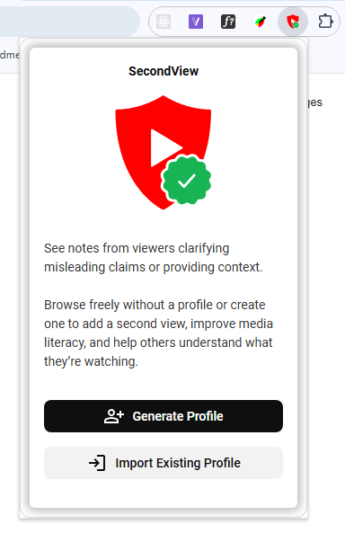 

**Profile Overview**

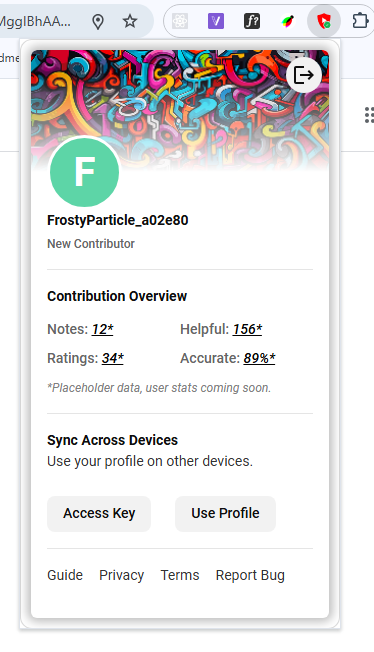 

> **Your access key is the ONLY way to recover your account.**
> 
> - We don't have your email
> - We can't reset your password
> - If you lose your access key, your account is gone forever
> 
> **Save it:**
> - Download as .txt file
> - Copy to password manager
> - Write it down

**Access Credentials**

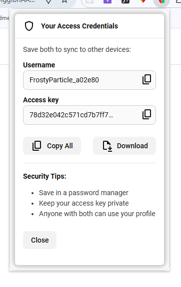 

**Import Profile**

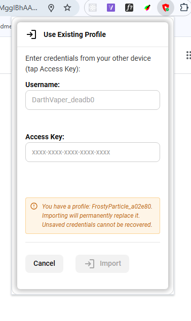 

## 2. Submitting Notes

- Click `Add Note` to open note submission form or click `N` on your keyboard

**Add Note button**

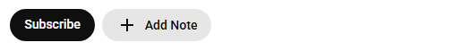 

#### Submission Requirements

- **Timestamp**: Note must target a specific claim (start/end times)
- **Category**: Choose the most accurate misinformation type
- **Explanation**: Minimum 10 characters, max 500 (might be adjusted later based on feedback)
- **Sources**: Include at least one credible references when possible

#### Best Practices

**DO**: Let the claim finish before your note appears
  - Notes show at END of timestamp segment
  - Gives content a fair chance to make its case
  
**DO**: Be specific and cite sources
  - "According to [source], the actual figure is X"
  - Link to primary sources when available

**DON'T**: Make notes off-topic
  - Rating: "Off Topic" means note doesn't match the claim
  - Stay focused on the specific timestamp
  
**DON'T**: Use biased or inflammatory language
  - Rating: "Biased Language" penalizes emotional arguments
  - State facts neutrally

**Note submission form**

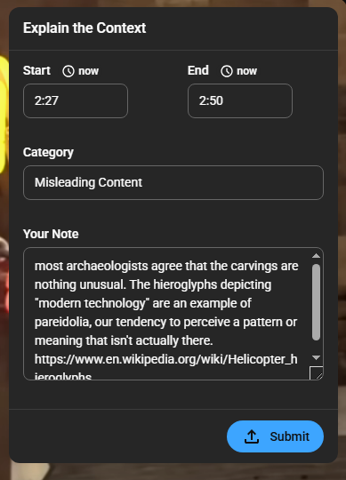 

## 2. Submitting Rating

#### How to Rate Effectively

**Ask yourself:**
1. **Evidence**: Are sources credible and relevant?
2. **Explanation**: Is the reasoning clear and logical?
3. **Coverage**: Does it address the full claim?
4. **Tone**: Is it objective and constructive?

**Note rating form**

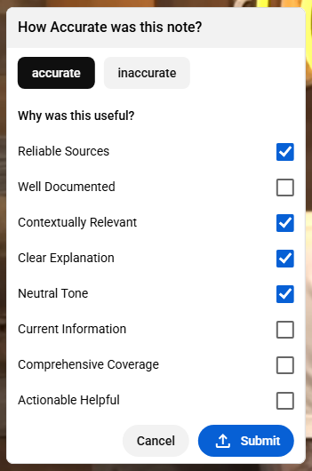

## 3. The Note 
- When a new video is opened the notes are fetched for that video
- hovering over the progress bar will show the noted segments, no colored segments means no notes for said video

**Noted segments**

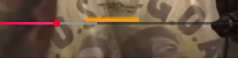

- As the video is playing, at the end of the noted segments, a collapsed version of the note will popup
- Can be dismissed immediately with `Escape` key, otherwise It auto dismiss after a few seconds
- Hovering over it will reset the auto dismiss timer 

**Collapsed**

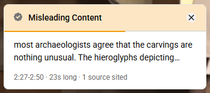

- Clicking on the note or hitting `Enter` key will expand and and put it on focus
- Clicking `x` close button or pressing `Escape` will close the note

**Expanded**

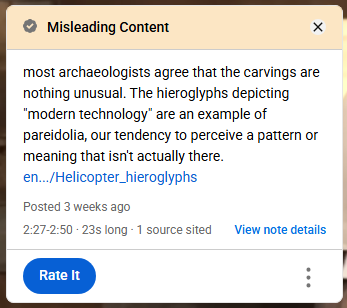

### Anatomy Of A Note

**Note Header**

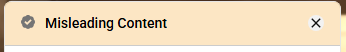

- note status + misinformation type + close note button
- note statue:
    - Gray Icon: **pending** (e.g Community hasn't agreed yet over the quality of the note or not enough votes to form a consensus) 
    - Green Icon: **Active** (e.g Community consensus currently agrees this note acceptable) 

**Note Body**

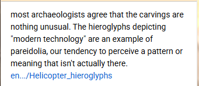

- The full note body with clickable sources 

**Note meta data and action footer**

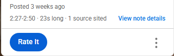

- Shows time elapsed since creation
- start and end time of the addressed claim
- sources count
- text button to view note details 
- button to rate a note(doesn't appear if it's your note or you have already rated it) 
- options menu with delete, report, edit and link note buttons (not yet functional, coming soon) 

## 4. Details panel

#### What the Scores Mean

> Some of the stats will be hidden until you vote, to prevent influencing votes 

**Accuracy Score** (-1 to +1)
- Above +0.25: Active (community trusts this note)
- Between -0.25 and +0.25: Pending (mixed feedback)
- Below -0.25: Hidden (community rejects this note, these don't get fetched)

**Confidence Score** (0% to 100%)
- How certain is the community about the status
- Higher confidence = more consistent ratings

**Dimensional Scores(experimental)**
Each dimension shows % of votes that rated it positively
- 75%+ = Strong in this area
- 25-75% = Mixed feedback
- <25% = Weak in this area

**Note details(experimental)**

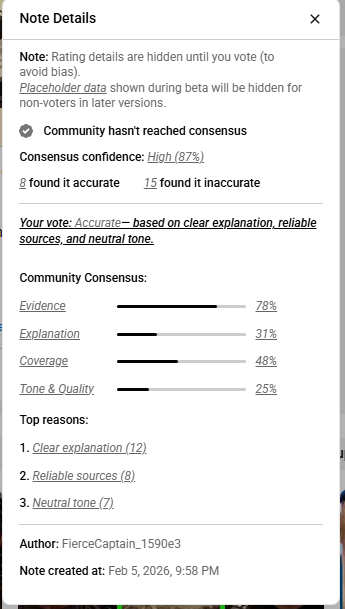

- you can also finds all notes under video description 

**Notes overview**

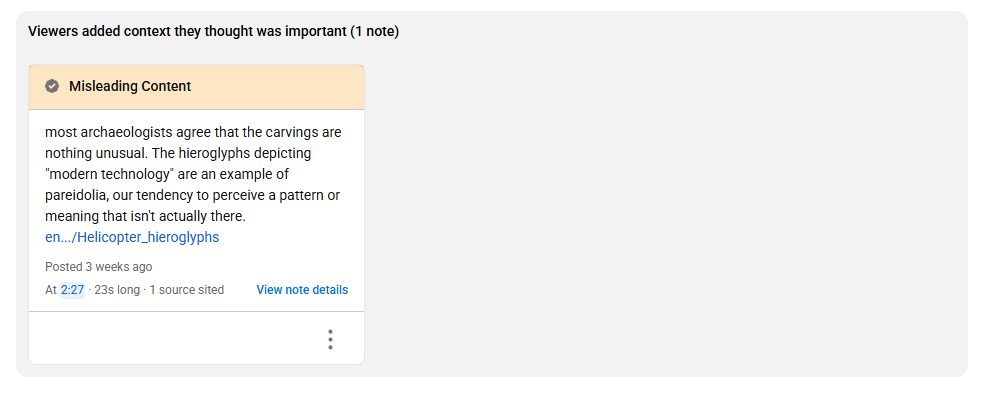

## 3. Keyboard Navigation Guide

**When a note appears:**

- `Enter` - Open and focus note
- `Escape` - Dismiss note (works when open or closed)

**Inside an open note:**

- `Tab` - Navigate through buttons and links
- `Enter/Space` - Activate focused button/link
- `Escape` - Close note
 
**Multiple notes:**

- New notes appear on top (collapsed)
- `Escape` once - Dismiss top note
- `Escape` again - Close underlying note Or wait for auto-dismiss (collapsed notes)

**Options Menu**

- `Enter` or `Space` - Open menu (when button focused)
- `Escape` or click outside - Close menu

**Navigation Between Panels**

- `Enter`/`Space` - Move to next panel (when button focused)
- `Backspace` - Go back to previous panel

**Rating Panel**

Tab navigation:

- `←`/`→` Arrow keys - Switch between Accurate/Inaccurate tabs
- `Tab` - Move through checkboxes in active tab
- `Space` - Select/deselect checkbox
- `Enter` - Submit rating

**Global Shortcuts**

- `N` - Toggle note submission form
- `Escape` - Close active form/panel
